# Diagrama de Flujo - Script Lectura HR

## Vista General del Proceso

```mermaid
flowchart TD
    A0[🚀 __main__] --> A1[📋 configurar_logging]
    A1 --> A2[🔧 main]
    A2 --> A3[✅ verificar_dependencias]
    A3 --> B0{🔀 MODO_LOCAL?}
    
    %% FLUJO LOCAL
    B0 -->|True| C0[🏠 Modo Local]
    C0 --> C1[📂 procesar_archivo_local]
    C1 --> C2{📄 Archivo existe?}
    C2 -->|Si| C3[📖 extraer_texto_por_pagina]
    C2 -->|No| ERROR1[❌ Error archivo]
    C3 --> E0[📊 PROCESAMIENTO COMÚN]
    
    %% FLUJO MV
    B0 -->|False| D0[🌐 extraer_keyVaults_serviceBus]
    D0 --> D1[🔄 Bucle Principal MV]
    D1 --> D2[📥 leer_cola_auditorias]
    D2 -->|Mensaje| D3[☁️ leer_contenido_blob]
    D2 -->|Sin mensaje| D1
    D3 -->|Éxito| E0
    D3 -->|Error| D1
    
    %% PROCESAMIENTO COMÚN PDF
    E0 --> F0[📝 extraer_texto_pdfplumber]
    F0 --> F1{📝 Texto extraído?}
    F1 -->|Si| G0
    F1 -->|No| F2[🖼️ extraer_texto_ocr_por_hoja]
    F2 --> G0{🎯 GPU Disponible?}
    
    %% ESTRATEGIA OCR
    G0 -->|Si| H0[⚡ ocr_batch_gpu]
    G0 -->|No| I0[🔧 ThreadPoolExecutor CPU]
    
    %% PROCESAMIENTO GPU
    H0 --> H1{🖥️ CUPY disponible?}
    H1 -->|Si| H2[⚡ preprocesar_imagen_gpu]
    H1 -->|No| H3[💻 preprocesar_imagen_cpu]
    H2 --> H4[📐 corregir_inclinacion]
    H3 --> H4
    H4 --> H5[🔄 encontrar_angulo_skew]
    H5 --> H6{📐 Ángulo > 0.5°?}
    H6 -->|Si| H7[🔄 rotar_imagen]
    H6 -->|No| H8[🎨 preprocesar_imagen]
    H7 --> H8
    H8 --> H9[👁️ EasyOCR readtext]
    H9 --> H10[⚖️ _seleccionar_mejor_ocr]
    H10 --> J0
    
    %% PROCESAMIENTO CPU
    I0 --> I1[📄 ocr_hibrido_una_pagina]
    I1 --> I2{🤖 OCR_ENGINE}
    I2 -->|hybrid| I3[⚖️ EasyOCR + Tesseract]
    I2 -->|easyocr| I4[👁️ Solo EasyOCR]
    I2 -->|tesseract| I5[📖 Solo Tesseract]
    I3 --> I6[⚖️ _seleccionar_mejor_ocr]
    I4 --> I6
    I5 --> I6
    I6 --> J0[📊 CLASIFICACIÓN]
    
    %% CLASIFICACIÓN Y EXTRACCIÓN
    J0 --> K0[🏷️ clasificar_paginas_por_tipo]
    K0 --> K1{📋 Tipos encontrados?}
    K1 -->|Si| K2[🔄 Loop tipos documento]
    K1 -->|No| ERROR2[❌ Sin tipos]
    K2 --> L0[🎯 procesar_subdocumento]
    L0 --> L1[🔍 Loop patrones]
    L1 --> L2{🎯 Patrón encontrado?}
    L2 -->|Si| L3[🤖 qa_pipeline]
    L2 -->|No| L1
    
    %% PIPELINE IA
    L3 --> L4[🧹 limpiar_contexto]
    L4 --> L5[🔧 corregir_caracteres_malformados]
    L5 --> L6[🤖 obtener_respuesta_openai]
    L6 --> L7[📝 limpiar_respuesta_modelo]
    L7 --> L8{🔄 Más patrones?}
    L8 -->|Si| L1
    L8 -->|No| M0
    
    %% ALMACENAMIENTO
    M0[📊 convertir_resultados_a_dataframe] --> M1[📅 limpiar_fechas]
    M1 --> M2[🔍 consultar_radicado_iq]
    M2 --> M3[💾 WriteSQL]
    M3 --> N0{🔀 MODO_LOCAL?}
    N0 -->|False| N1[📤 enviar_identificaciones_servicebus]
    N0 -->|True| N2[🗑️ Limpieza archivos locales]
    N1 --> END1[✅ FIN MV - Vuelve a D1]
    N2 --> END2[✅ FIN LOCAL]
    END1 --> D1
    
    %% ESTILOS
    classDef startEnd fill:#e1f5fe
    classDef decision fill:#fff3e0
    classDef process fill:#f3e5f5
    classDef gpu fill:#e8f5e8
    classDef error fill:#ffebee
    
    class A0,END1,END2 startEnd
    class B0,C2,F1,G0,H1,H6,I2,K1,L2,L8,N0 decision
    class C1,F0,F2,H0,I0,J0,K0,L0,M0,M1,M2,M3 process
    class H2,H4,H5,H7,H8,H9,H10 gpu
    class ERROR1,ERROR2 error
```

## Descripción del Flujo

Este diagrama muestra el flujo completo del script de procesamiento de documentos HR con OCR.

### Puntos Clave:
- **🔀 Bifurcación principal**: Modo Local vs MV (Cola/Blob)
- **⚡ Optimización GPU**: Procesamiento batch vs individual
- **🤖 IA Integration**: Pipeline con OpenAI GPT-4
- **📊 Almacenamiento**: Base de datos SQL Server
