# Arquitectura del Sistema OCR

## Diagrama de Fases

```mermaid
graph LR
    subgraph F1["🚀 FASE 1: ARRANQUE"]
        A1[Configurar Logs]
        A2[Verificar Herramientas]
        A3[Decidir Modo]
    end
    
    subgraph F2["📥 FASE 2: OBTENER ARCHIVO"]
        B1[Archivo Local]
        B2[Descargar de Nube]
    end
    
    subgraph F3["👁️ FASE 3: LEER TEXTO"]
        C1[Leer PDF Directo]
        C2[Usar OCR con IA]
        C3[Limpiar Imagen]
        C4[Extraer Caracteres]
    end
    
    subgraph F4["🏷️ FASE 4: CLASIFICAR"]
        D1[Separar Tipos]
        D2[Furips]
        D3[Factura]
        D4[Historia]
    end
    
    subgraph F5["🤖 FASE 5: EXTRAER DATOS"]
        E1[Buscar Patrones]
        E2[Preguntar a IA]
        E3[Limpiar Respuestas]
    end
    
    subgraph F6["💾 FASE 6: GUARDAR"]
        F1_["Organizar Datos"]
        F2_["Guardar en BD"]
        F3_["Enviar Notificación"]
    end
    
    %% FLUJO PRINCIPAL
    A1 --> A2 --> A3
    A3 --> B1
    A3 --> B2
    B1 --> C1
    B2 --> C1
    C1 --> C2
    C2 --> C3 --> C4
    C4 --> D1
    D1 --> D2
    D1 --> D3  
    D1 --> D4
    D2 --> E1
    D3 --> E1
    D4 --> E1
    E1 --> E2 --> E3
    E3 --> F1_ --> F2_ --> F3_
    
    %% ESTILOS
    classDef fase1 fill:#e3f2fd
    classDef fase2 fill:#f3e5f5  
    classDef fase3 fill:#e8f5e8
    classDef fase4 fill:#fff3e0
    classDef fase5 fill:#fce4ec
    classDef fase6 fill:#f1f8e9
    
    class A1,A2,A3 fase1
    class B1,B2 fase2
    class C1,C2,C3,C4 fase3
    class D1,D2,D3,D4 fase4
    class E1,E2,E3 fase5
    class F1_,F2_,F3_ fase6
```

## Explicación del Proceso

### 🚀 Fase 1: Arranque
- Configuración inicial del sistema
- Verificación de herramientas (Tesseract, GPU, etc.)
- Decisión de modo de operación

### 📥 Fase 2: Obtener Archivo  
- **Local**: Lee archivo del sistema de archivos
- **Nube**: Descarga desde Azure Blob Storage

[... más explicaciones]
